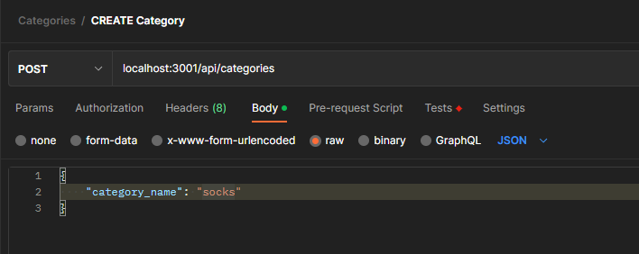
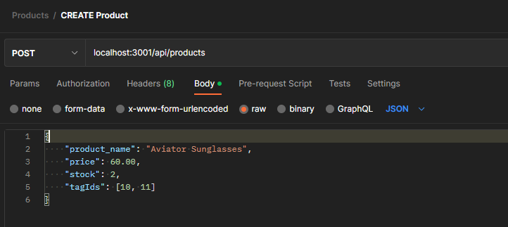
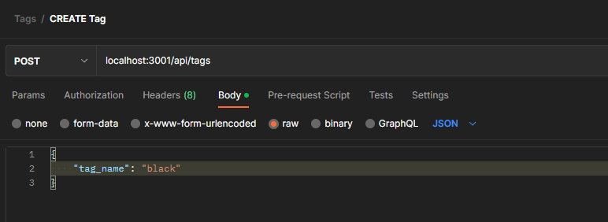
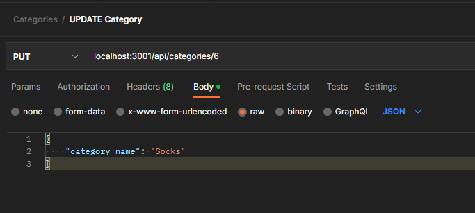
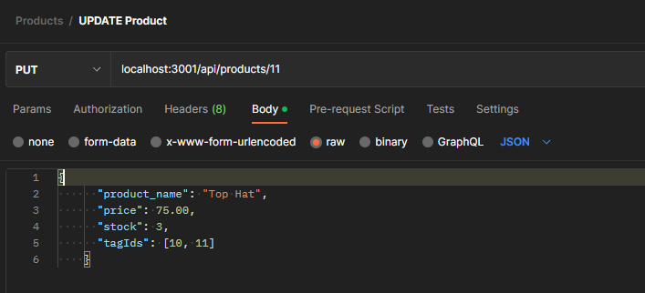
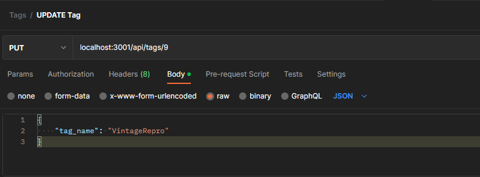

  
  # Employee Database
  
  ## Description
  This application is intended to allow users to create and maintain a product database for an E-commerce website.
  This project was developed as a requirement of the Berkeley Fullstack Flex Web Development coding bootcamp. Skills targeted include: using Sequelize to create models and interact with an SQL database, creating RESTful API routes, and testing API routes using Postman.
  
  ## Table of Contents
  
  * [Installation](#installation)
  * [Usage](#usage)
  * [Demo](#demo)
  * [Contributing](#contributing)
  * [Tests](#tests)
  * [License](#license)
  * [Questions](#questions)
  
  ## Installation
   1. [Clone](https://github.com/sarah-jensen/e-commerce-backend.git) or [download](https://github.com/sarah-jensen/e-commerce-backend/archive/refs/heads/master.zip) the repository to your computer. 
  2. Install the necessary packages: [node.js v18.12.1](https://nodejs.org/en)
  3. Open the root directory in your terminal (or Integrated Terminal if using VS Code) 
  4. Type `npm i` in the command line to install `node_modules`and required dependencies
  5. Create a .env file in the root directory with these parameters: 
    DB_NAME=ecommerce_db
    DB_USER=<your username>
    DB_PASSWORD=<your password>
  6. Open MySQL Shell using the command: 'mysql -u <your username> -p' 
  7. Enter <your password>
  8. Create the database by entering the command: 'source db/schema.sql;'
  9. Close MySQL Shell using the command: 'exit'
  10. If you do not already have an existing API platform, you can follow instructions to create an account and install Postman [here](https://www.postman.com/).
  
  
  ## Usage
  * You may replace the existing seeds with your own if desired. If you would like to seed the database, enter `npm run seed` in the command line.
  * Run the application by typing `npm start` in the command line.
  * Open and use your API Platform (e.g., Postman) to GET, CREATE, UPDATE, and DELETE products, tags, or categories.
  * For instructions related to using Postman visit their [Learning Center](https://learning.postman.com/docs/introduction/overview/)
  ---
  Sample CREATE Category 
  
  ---
  Sample CREATE Product
  
  ---
  Sample CREATE Tag
  
  ---
  Sample UPDATE Category
  
  ---
  Sample UPDATE Product
  
  ---
  Sample UPDATE Tag
  
  
  
  This application uses the following technologies:
  * JavaScript
  * Node.js v18.12.1
  * Express
  * MySQL2
  * Sequelize
  * Environmental Variables ('dotenv')
  
  ## Demo
  View a video walkthrough of the app [here](https://drive.google.com/file/d/1C2vr_pOIUnaGqt-vFUGBiXGZJG3AvpAJ/view?usp=sharing).

  ## Contributing
  Source code provided by UC Berkeley Fullstack Flex Web Development coding bootcamp.
  
  ## Tests
  You may test the RESTful API routes using an API Platform such as Postman.
  
  ## License
  This project is licensed under the MIT License - see Badge link for details.
  
  ## Questions
  If you have any questions or issues with the repo, please reach out to "[sarah-jensen]("https://github.com/sarah-jensen")" or create an issue in the "["repo"](https://github.com/sarah-jensen/e-commerce-backend)".